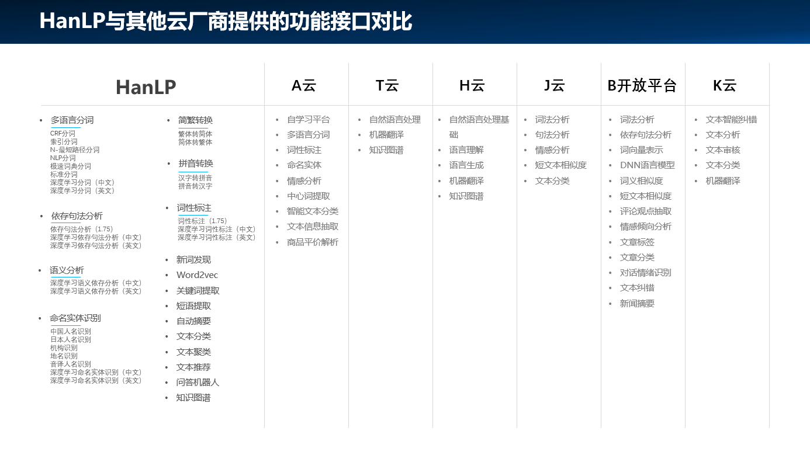

#### 开源HanLP
HanLP是Hankcs主持并开源的由一系列模型和算法组成的工具包，具有功能完善、性能高效、架构清晰、语料时新、可自定义等特点，提供词法分析、句法分析、文本分析和情感分析等功能，已被广泛的应用在工业、科研、教育等领域中。

不同于一些简陋的分词类库，HanLP精心优化了内部数据结构和IO接口，做到了毫秒级的冷启动、千万字符每秒的处理速度，而内存最低仅需120MB。无论是移动设备还是大型集群，都能获得良好的体验。同时HanLP提供训练模块，可以在用户的语料上训练模型并替换默认模型，以适应不同的领域。项目主页上提供了详细的文档，以及在一些开源语料上训练的模型。

HanLP自2014年发布以来广受欢迎，目前，HanLP已经是全球最受欢迎的NLP技术之一，在GitHub上已有超过21000个Star，有1600多个开源项目依赖HanLP，出现了5600多个分支（Fork）项目；数以万计的人工智能项目使用HanLP开发。

##### HanLP官网
[HanLP官网](https://www.hanlp.com) (https://www.hanlp.com)

自然语义（青岛）科技有限公司是GitHub开源项目HanLP的运营机构，2019年推出了HanLP.com云端服务，将开源HanLP的全部功能进行线上部署，并通过公开API调用的方式供开发人员使用，能够大幅节约NLP项目的开发时间，并节省了用户设计算法、训练模型的开发费用。

HanLP.com在线API服务采取RESTful软件架构，将HanLP的全部功能进行线上部署，并通过公开API调用的方式供开发人员使用，能够大幅节约NLP项目的开发时间，并节省了用户设计算法、训练模型的开发费用。

目前，在线API服务包括15类、37项不同的接口，涵盖机器学习算法与深度学习算法，能满足基本上所有NLP业务的需求。

##### 评价
HanLP是GitHub上最热门，应用最广泛NLP技术；也是众多AI开发人员和相关领域科研人员的必备工具！

开源界广受欢迎的NLP项目，GitHub上加星2万+，项目更新最快、社区最热门，多个第三方评测性能位居榜首

在Github上fork数超过5800，已助力众多AI项目获得成功

支持多用户协同标注语料库，多用户工作更加高效

允许训练私有模型，依据自定义的语料库，还可以得到更多更精准的功能

##### 功能
- 中文分词

将文本切分为独立语义单位。支持粗分、细分双重标准，高低优先级自定义词典，多语种

- 词性标注

给每个单词标注语法类别，支持多种词性标注集：CTB、PKU、863、UD、NPCMJ，多语种

- 命名实体识别

识别文本中的专有名词，支持多种规范：PKU、MSRA、OntoNotes，黑白名单词典、多语种

- 依存句法分析

分析单词语法上的依赖，支持多种句法体系：SD、UD、PMT，投射/非投射，多语种

- 成分句法分析

分析句子在语法上的递归构成，并将其表示为树形结构。支持可视化、多语种

- 语义依存分析

分析句子中单词之间的语义关系图。支持多标准：CSDP、DM、PAS、PSD，支持多语种

- 语义角色标注

分析句子的谓词论元结构。支持可视化、多语种

- 抽象意义表示

将句子的意义表示为以概念为节点的单源有向无环图的语言学框架，支持多语种

- 指代消解

将文本中指代同一事物的提名（mention）聚集到同一个簇

- 语义文本相似度

判断一对短文本的语义相似度

- 文本风格转换

将原文本的风格转换为目标风格，同时保持语义不变

- 关键词短语提取

提取文本中最具有代表性的关键词以及短语

- 抽取式自动摘要

从文章中筛选出一些作为摘要的中心句子：既要紧扣要点，又要避免赘语

- 生成式自动摘要

为文章生成一段简短的概括性摘要

- 文本纠错

改正文本中潜在的拼写、标点、语法等表达错误

- 文本分类

判断一段文本所属的类别，例如新闻栏目和语种

- 情感分析

判断一段文本的情感极性，数值的正负代表正负面情绪

关注我，带你深入了解GPT技术及应用。
