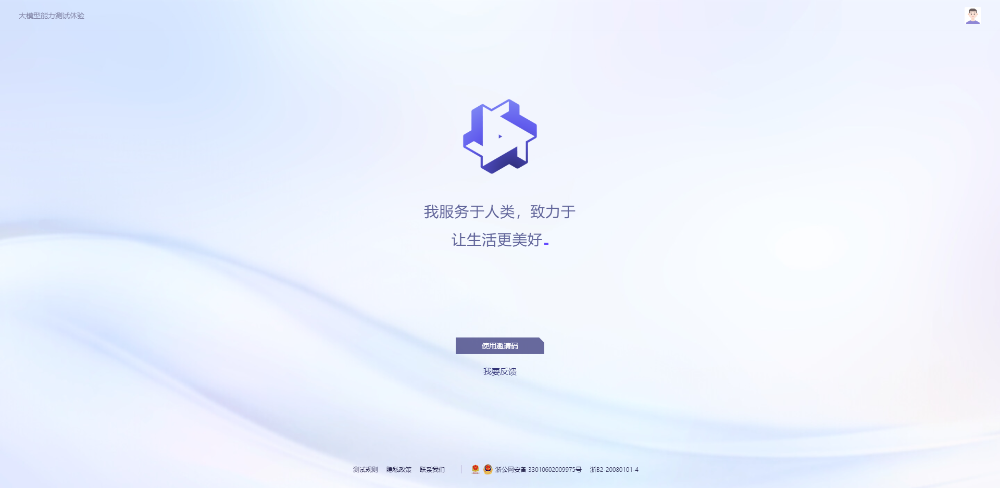

#### 通义千问
百度文心一言之后，阿里也跟随其后宣布了阿里版ChatGPT——通义千问。目前阿里没有给出更多相关信息，目前被描述为：通过大型语言模型 (LLM) 专门针对人类命令的生产力助手和创意生成器。

#### 官网
通义千问官网地址：https://tongyi.aliyun.com

在有限的信息里，官网上给出了三条标语：
+ 我服务于人类，致力于让生活更美好
+ 我是通义千问，一个专门响应人类指令的大模型
+ 我是效率助手，也是点子生成机

可以看出，通义千问的目标也是成为中国版ChatGPT，希望可以成为人们的效率工具。

#### 如何注册
如何注册通义千问？可以直接访问通义千问官网，使用阿里云账号即可直接登录，如果没有阿里云账号也可以只用手机号快速完成注册。

#### 通义千问邀请码
目前想要体验通义千问则还需要使用邀请码，邀请码由官方指定发放。想要体验的同学还需要再耐心等待一下，可以关注我及时获得公测信息。

关注我，带你深入了解GPT技术及应用。
