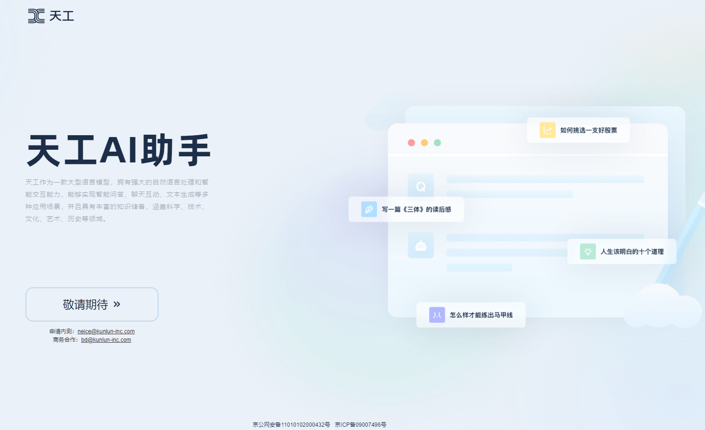

**最新内容发布地址：[http://chatgptcn.eshop88.cn](http://chatgptcn.eshop88.cn)**

#### 天工
由昆仑万维和奇点智源联合研发的新一代大语言模型天工正式开启邀请测试，宣称是国内首个双千亿级（千亿预训练基座模型和千亿 RLHF（Reinforcement Learning from Human Feedback）模型）大语言模型。

#### 官网
天工AI助手官网：https://tiangong.kunlun.com

#### 天工AI助手
天工作为一款大型语言模型，拥有强大的自然语言处理和智能交互能力，能够实现智能问答、聊天互动、文本生成等多种应用场景，并且具有丰富的知识储备，涵盖科学、技术、文化、艺术、历史等领域。

#### 如何使用
目前天工还没有开放公测，想要使用的同学还需要再耐心的等待一段时间。关注我可以及时获得公测通知。