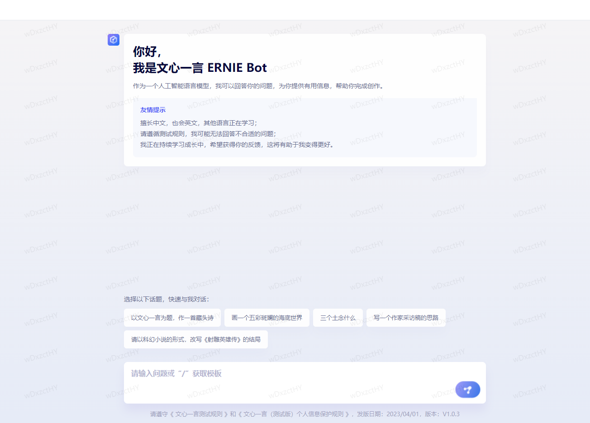
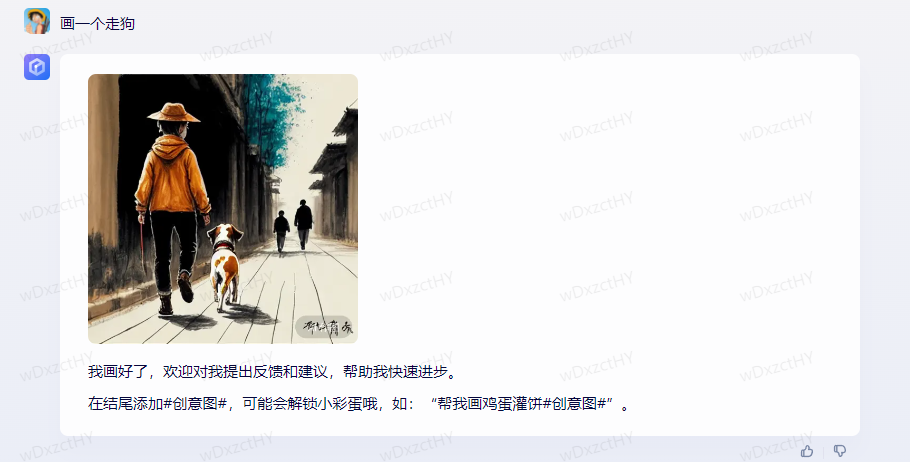

**最新内容发布地址：[http://chatgptcn.eshop88.cn](http://chatgptcn.eshop88.cn)**

#### 文心一言
中文版ChatGPT、百度版ChatGPT,寄托着国产希望的文心一言已经发布。作者已经上手体验，总体感觉就是惊鸿一瞥，继续努力。
#### 官网
想要体验的朋友可以到文心一言官网提交预约,官网：https://yiyan.baidu.com。

#### 大语言模型
知识增强大语言模型

百度全新一代知识增强大语言模型，文心大模型家族的新成员，能够与人对话互动，回答问题，协助创作，高效便捷地帮助人们获取信息、知识和灵感。

#### 文心一言可以做什么
与人对话互动，回答问题，协助创作，高效便捷地帮助人们获取信息、知识和灵感。
+ 写一篇太空旅行的市场分析报告
+ 帮我画一枝晶莹剔透的牡丹花
+ 曾国藩和林则徐相差几岁
+ 为什么太阳系中，水星和金星没有卫星
+ 量子计算机能帮我们移民火星吗？

基于飞桨深度学习平台和文心知识增强大模型，持续从海量数据和大规模知识中融合学习具备知识增强、检索增强和对话增强的技术特色。

#### 上手体验

笔者也上手体验了一把，让文心一言给我画了一个走狗。

不得不说画的还是蛮形象的，至少字面意思刻画的淋漓尽致。中文博大精深，文心好好学习一下新华字典、成语大全等内容，很好的理解了词汇所要真实表达的意思，相信文心一言可以拥有更好的表达效果。